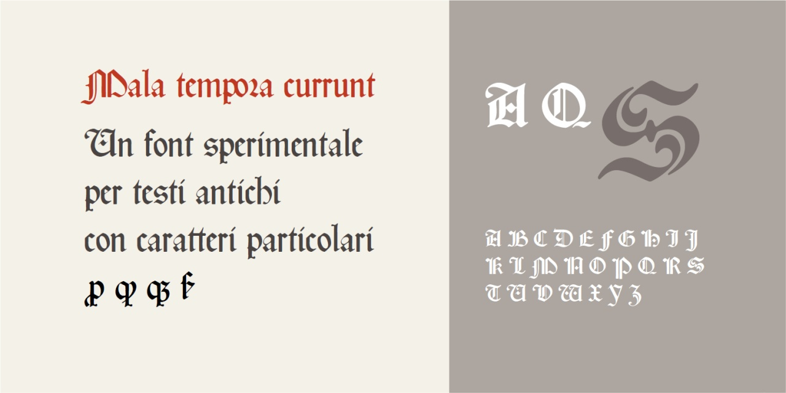
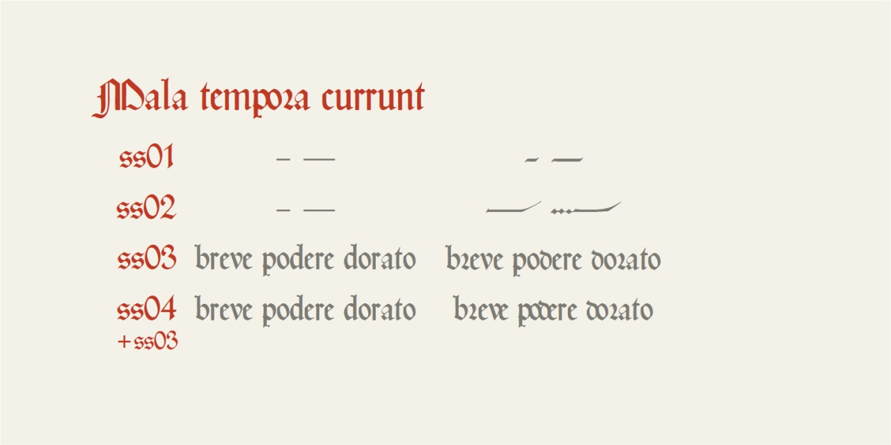

# Mala tempora currunt
* Versione 1.103: sistemazione accenti e aggiunta di alcuni caratteri
* Versione 1.0: versione iniziale

Per testare il font, vedere la [pagina interattiva](https://m-casanova.github.io/MalaTemporaCurrunt/).

## Descrizione

Il font _Mala tempora currunt_ è basato sul carattere _rotunda_, tipico di edizioni a stampa tra XV e XVI secolo. Il font è basato in particolare sul carattere _[Gótico Cervantes](https://fontsinuse.com/typefaces/233950/gotico-cervantes)_ della tipografia Gans, ma con alcune variazioni.

Sono presenti diverse caratteristiche stilistiche (ss01, ss02, ss03, ss04) per simulare particolari comportamenti.

In particolare la caratteristica __ss03__ è utilizzata per le lettere __r__ e __d__ alternative secondo le regole di Meyer (_[Die Buchstaben-Verbindungen der sogenannten gothischen Schrift](https://www.digitale-sammlungen.de/en/view/bsb00119312?page=128,129)_, 1880): quando __d__ è seguita da una lettera convessa verso sinistra, diventa arrotondata; quando __r__ è preceduta da forma convessa verso destra, diventa arrotondata.

La caratteristica __ss04__ cerca invece di simulare l'ulteriore regola di Meyer, secondo cui quando si incontrano due lettere convesse (la prima convessa verso destra e la seconda convessa verso sinistra), si ha una sovrapposizione tra le due lettere; per un uso ottimale si utilizza __ss04__ insieme a __ss03__.

